# 🌌 VibeSync: Atomic Unity ↔ Blender Sync

> [!NOTE]
> **Project Scaffolding:** This repository currently serves as the foundational scaffolding and architectural core. It is intended for full operational use once the accompanying **UnityVibeBridge** and **BlenderVibeBridge** applications are fully finalized.

**VibeSync is a live bridge that synchronizes Blender and Unity scenes automatically, safely, and in real time.**

**Unlike traditional exporters, VibeSync enforces atomic, crash-safe sync across both engines—ensuring your data is never corrupted.**

> [!TIP]
> **TL;DR:** Move objects in Blender → VibeSync safely updates Unity in real-time → Automatic rollback if anything breaks.

> [!WARNING]
> **Experimental Status (v0.4):** This project is currently in active research and development. APIs and protocols are subject to breaking changes.

---

## 🎯 At a Glance

### 🎨 For Artists
- **Instant Sync**: Move an object in Blender, and it moves in Unity instantly.
- **Material Harmony**: Change a color in Blender, see it update in Unity immediately.
- **Safety First**: Automatic rollbacks protect your project from crashes or errors.

### 🛠️ For Developers
- **Governed Control Plane**: Zero-trust architecture using a hardened Go Orchestrator.
- **Atomic Transactions**: Formal intent-to-state pipeline with binary-level hash verification.
- **Extensible ISA**: Numbered toolset for deterministic AI and CLI-driven scene orchestration.

---

## 🔄 Visual Workflow (How it feels)

```mermaid
sequenceDiagram
    participant B as 🧊 Blender (Artist)
    participant O as 🧠 VibeSync (Brain)
    participant U as 🎮 Unity (Engine)

    B->>O: "I moved the Crate to [1, 0, 5]"
    O->>O: Check if move is safe & valid
    O->>U: "Update Crate position"
    U-->>O: "Success! Crate moved."
    O-->>B: "Sync Complete ✅"
```


---

## 🏎️ Quick Start
1.  **Install Prerequisites**: Ensure you have **Go 1.24+**, **Python 3.10+**, **Unity 2022.3+**, **Blender 3.6+**, and **Git LFS**.
2.  **Initialize LFS**: `git lfs install`
3.  **Start Orchestrator**: 
    ```bash
    cd mcp-server && go run main.go contract.go
    ```
3.  **Connect Adapters**: Follow the **[Handshake Guide](HUMAN_ONLY/INSTALL.md)** to install and launch the Unity and Blender plugins.
4.  **Sync Test**: Use the AI or CLI to run `handshake_init` followed by `sync_transform` to verify the connection.

> [!IMPORTANT]
> ⚠️ **Not Technical? Start Here!**  
> If you’re new to AI-assisted Blender/Unity workflows, don’t worry. We’ve created a **Complete Beginner’s Manual** that explains everything step by step, from setup to safe usage.  
> 👉 [**Beginner’s Manuals & Safety Guides**](#-user-guides--learning)

---

## 💡 Example Use Case: Transform Sync
**Scenario:** You are modeling a prop in Blender and want to see it update live in your Unity scene without manual re-exporting.

1.  **Select** the object in Blender (e.g., `Prop_Crate`).
2.  **Issue** a sync command (via AI or MCP):
    ```json
    { "tool": "sync_transform", "args": { "object_id": "Prop_Crate", "position": [1.0, 0.0, 2.5] } }
    ```
3.  **Verify**: The Orchestrator calculates the delta, validates the numerical safety, and pushes the update to Unity. If Unity crashes or the object is locked, the Orchestrator rollbacks the state and journals the failure.

---

## ⚡ What VibeSync Does
VibeSync turns the "export/import" nightmare into a deterministic state flow.
*   **Mirror Transforms**: Real-time delta-sync for position, rotation, and scale.
*   **Sync Materials**: Push property changes (Color, Roughness, Metallic) instantly.
*   **Atomic Mesh Transfer**: Full mesh updates with binary-level hash verification.
*   **Coordinated Camera/Selection**: Frame views and select objects across both engines.

---

## 🚫 What VibeSync is NOT
VibeSync follows a guest doctrine of intentional limitation. 
*   **Not a File Exporter**: It doesn't just write FBX files; it manages live engine state.
*   **Not a Pipeline Replacement**: It augments your existing workflow; it doesn't replace your asset source of truth.
*   **Not a Magic Button**: It is a governed control plane that requires both engines to be in a valid handshake state.

*See the **[Non-Goals & Doctrine](NON_GOALS.md)** for our core philosophical boundaries.*

---

## 🏛️ Architecture & Governance
VibeSync is built on a foundation of distributed systems rigor and zero-trust security.

- 🏛️ **[System Design & Architecture](metadata/SYSTEM_DESIGN.md)**: Deep dive into the "Brain and Limbs" model.
- 🛡️ **[Security Governance](metadata/SECURITY_GOVERNANCE.md)**: Details on "The Iron Box," HMAC signing, and AST auditing.
- 🧠 **[AI Safety Protocol](metadata/AI_SAFETY_PROTOCOL.md)**: How we prevent AI psychosis and ensure adversarial robustness.
- 🤖 [**AI Workflow Instructions**](metadata/AI_WORKFLOW.md): Pain-point focused procedural rules for AI bridge operators.
- 🤖 [**Multi-Agent Architecture**](HUMAN_ONLY/MULTI_AGENT_ARCHITECTURE.md): The "Tri-Silo" model for high-scale isolated automation.
- ⚖️ [**Absolute Invariance Contract**](metadata/INVARIANCE_CONTRACT.md): Mechanical, Contextual, and Semantic safety locks.
- 📜 [**Bridge Contract**](BRIDGE_CONTRACT.md): Absolute authority boundaries and operational guarantees.
- ⚖️ **[Formal Guarantees](metadata/FORMAL_GUARANTEES.md)**: The "Rules of Reality" and causality logic.
- 🔄 **[Master Procedural Flow](metadata/PROCEDURAL_FLOW.md)**: The strict, step-by-step lifecycle for deterministic syncing.
- ❄️ **[Freeze-Proof Guide](metadata/FREEZE_PROOF_GUIDE.md)**: Critical technical patterns to prevent engine deadlocks and hangs.

---

## 🚀 Features & Roadmap
For a complete matrix of implemented and planned capabilities, including technical status and development status:
[**VibeSync Feature Matrix & Status (FEATURES.md)**](FEATURES.md)

### Evolution Path


---

## 🛠️ Complete Tool Reference
<details>
<summary><b>View Tool Reference Primitives</b></summary>

### 1. 🏛️ Orchestrator Primitives
*   **`handshake_init`**: Establishes trust and rotates session tokens.
*   **`decommission_bridge`**: Broadcasts an emergency hierarchy lock to all connected engines.
*   **`emit_diag_bundle`**: Generates a ZIP of WAL, events, and state for diagnostics.
*   **`get_operation_journal`**: Returns the Write-Ahead Log (WAL) telemetry.

### 2. 📦 Sync Payloads
*   **`sync_asset_atomic`**: Full validated transfer via hidden `.vibesync/tmp` sandbox.
*   **`sync_transform`**: Lightweight, delta-based transform synchronization.
*   **`sync_material`**: Real-time property propagation (Color/Roughness/Metallic).
*   **`lock_object`**: Hierarchy-aware locking to prevent concurrent edit conflicts.
*   **`validate_precision`**: Enforces strict `>0.0001` delta thresholds to eliminate float drift.
</details>

---

## 🔗 Related Projects
*   [**unityvibebridge**](https://github.com/B-A-M-N/unityvibebridge) – The standalone Unity adapter and kernel for AI-driven editor orchestration.
*   [**BlenderVibeBridge**](https://github.com/B-A-M-N/BlenderVibeBridge) – The standalone Blender adapter and MCP server for creative automation.

---

## 📖 User Guides & Learning
New to VibeSync or AI-assisted creative workflows? Start here:
*   [**AI for Humans: The Beginner's Manual**](HUMAN_ONLY/FOR_BEGINNERS.md) – Essential reading on AI psychosis, cognition gaps, and how to work safely with AI co-pilots.
*   [**Blender Beginner's Manual**](HUMAN_ONLY/BLENDER_FOR_HUMANS.md) – Step-by-step setup and basic commands specifically for Blender artists.
*   [**For Hiring Managers: Engineering Audit**](HUMAN_ONLY/FOR_HIRING_MANAGERS.md) – A deep dive into the architectural decisions, security invariants, and systems engineering for recruiters and technical leads.

---

## 🏗️ Contributing
We welcome contributions that adhere to our **Zero-Trust** philosophy. Please read the **[Contributing Guide](CONTRIBUTING.md)** for language standards, testing requirements, and our "Gauntlet" PR review process.

---

## ⚖️ License & Legal Liability (v1.2)

#### 1. THE OPEN-SOURCE PATH: GNU AGPLv3
Free for non-commercial use. Pursuant to Section 13, networked modifications must provide source access.

#### 2. THE COMMERCIAL PATH: "WORK-OR-PAY"
Requires **Maintenance Contributions** or a **License Fee** for revenue-generating entities.

#### ⚠️ LIABILITY LIMITATION & INDEMNITY
1.  **NO WARRANTY**: Software provided "AS IS." The Author is **NOT liable** for project corruption, data loss, or "vibe" degradation in Unity or Blender.
2.  **HUMAN-IN-THE-LOOP**: All mutations are "Proposed" until validated. THE USER ACCEPTS FULL RESPONSIBILITY FOR ANY DATA MUTATION EXECUTED.

---

**Created by the Vibe Bridge Team.**