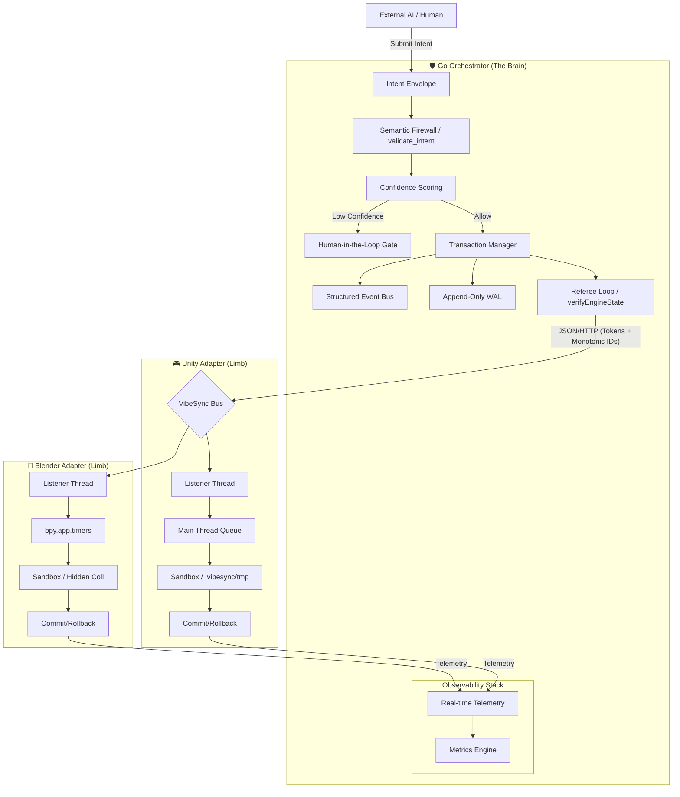

# VibeSync: Architectural Blueprint (v0.4)

This diagram illustrates the layered orchestration, governance, and verification stack.

## Security & Integrity Zones
1. **The Intent Zone**: Cryptographic provenance and semantic validation.
2. **The Verification Zone**: The "Referee" loop ensures reality matches intent.
3. **The Sandbox Zone**: Engine mutations are staged in isolation before being committed.
4. **The Forensic Zone**: Immuatable journals (WAL/Events) for replay and audit.

---
*Copyright (C) 2026 B-A-M-N*
