# VibeSync Atomic Workflow Diagram

This diagram illustrates the "Zero-Trust" orchestration between the Go MCP Server, Blender, and Unity.

```mermaid
sequenceDiagram
    participant B as 🧊 Blender Adapter
    participant M as 🛡️ Go MCP Server
    participant U as 🎮 Unity Adapter

    Note over B,U: 1. PREFLIGHT & SNAPSHOT
    M->>B: Request Snapshot & Preflight (Checksum)
    B-->>M: Return Snapshot ID + Hash + Preflight Report
    
    alt Preflight Fails
        M->>B: Trigger Panic / Block Sync
    else Preflight Passes
        Note over B,U: 2. ATOMIC TRANSFER
        M->>B: Begin Export (Sandboxed)
        B-->>M: Export Complete (Path + Metadata)
        M->>U: Begin Import (Sandboxed)
        U-->>M: Import Complete (Pending Commit)
        
        Note over B,U: 3. POST-IMPORT VALIDATION
        M->>U: Request Validation (Hierarchy + Hash)
        U-->>M: Return Post-Import Hash
        
        Note over M,U: 4. COMMIT OR ROLLBACK
        alt Hashes Match
            M->>U: Commit Asset (Move to Assets/...)
            M->>B: Mark Transfer Successful
            M->>M: Journal: Success
        else Hash Mismatch (Silent Failure)
            M->>U: Rollback (Delete Temp Assets)
            M->>B: Restore Last Snapshot
            M->>M: Journal: Failure + Diff Report
        end
    end
    
    Note over B,U: 5. HEARTBEAT (Continuous)
    loop Every 5s
        M->>B: Heartbeat Check
        M->>U: Heartbeat Check
        alt Deadlock Detected
            M->>M: Trigger Circuit Breaker (Lock Hierarchy)
        end
    end
```

## Phase Details

### 1. Preflight
- **Resource Limits**: Checks vertex count, texture size, and modifier complexity.
- **Contract Enforcement**: Verifies bone hierarchy and vertex order matches Unity's expectations.

### 2. Atomic Transfer
- **Sandboxing**: Exports and imports happen in temporary directories (`.vibesync/tmp`).
- **Transaction ID**: Every step is tagged with a `tid` for journaling.

### 3. Post-Import Validation
- **Semantic Integrity**: Checks for missing materials or broken references.
- **Hash Verification**: Ensures the binary data in Unity matches the Blender export exactly.

### 4. Commit/Rollback
- **Idempotence**: Commit moves files to their final location; Rollback purges the sandbox.
- **Undo Stack**: Syncs the undo stack to ensure `Ctrl+Z` works across both engines.

---
*Copyright (C) 2026 B-A-M-N*
